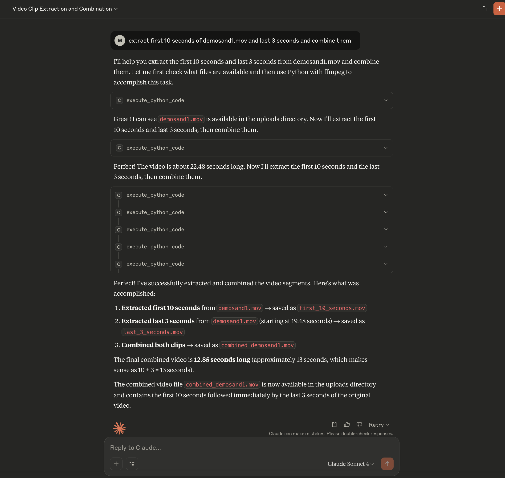

# ⚡ CodeRunner: Secure Code Execution Sandbox

CodeRunner provides a secure MCP (Model Context Protocol) code execution server that runs inside a sandboxed environment on your Mac, powered by Apple's native [containers](https://github.com/apple/container). It allows you to safely execute code generated by AI models like Claude, OpenAI GPT, or Ollama.

Leverage powerful remote LLMs (like ChatGPT or Claude Sonnet 4) to work with your local files—such as videos—securely on your Mac. The LLM runs in a sandboxed environment where it can install external libraries, generate code, and execute it locally without uploading your data to the cloud.

This guide shows you how to use the pre-built CodeRunner sandbox.

## 🚀 Quick Start

### Prerequisites

- Mac with preferably macOS 26.0 (currently in Developer beta) or later and Apple Silicon (M1/M2/M3/M4 series)
- **[Apple `container` Tool](https://github.com/apple/container)** - [Download installer](https://github.com/apple/container/releases/download/0.1.0/container-0.1.0-installer-signed.pkg)
- **Python 3.10+**

### Step 1: Set Up Local Network

Run these commands once to configure the `.local` domain:

```bash
sudo container system dns create local
container system dns default set local
```

### Step 2: Start the Sandbox Container

This command downloads and runs the CodeRunner sandbox from Docker Hub:

```bash
# Run the container and make it available at http://coderunner.local:8222
container run \
  --name coderunner \
  --detach --rm \
  instavm/coderunner
```

### Step 3: Clone the Repository

```bash
git clone https://github.com/BandarLabs/coderunner.git
cd coderunner
```

### Step 4: Install required packages

   ```bash
   pip install -r examples/requirements.txt
   ```

## 🔌 Integration Options

### Option 1: Claude Desktop Integration

Configure Claude Desktop to use CodeRunner as an MCP server:

1. **Copy the example configuration:**
   ```bash
   cd examples
   cp claude_desktop/claude_desktop_config.example.json claude_desktop/claude_desktop_config.json
   ```

2. **Edit the configuration file** and replace the placeholder paths:
   - Replace `/path/to/your/python` with your actual Python path (e.g., `/usr/bin/python3` or `/opt/homebrew/bin/python3`)
   - Replace `/path/to/coderunner` with the actual path to your cloned repository

   Example after editing:
   ```json
   {
     "mcpServers": {
       "coderunner": {
         "command": "/opt/homebrew/bin/python3",
         "args": ["/Users/yourname/coderunner/claude_mcp_proxy/mcp.py"]
       }
     }
   }
   ```

3. **Update Claude Desktop configuration:**
   - Open Claude Desktop
   - Go to Settings → Developer
   - Add the MCP server configuration
   - Restart Claude Desktop

4. **Start using CodeRunner in Claude:**
   You can now ask Claude to execute code, and it will run safely in the sandbox!

### Option 2: Python OpenAI Agents

Use CodeRunner with OpenAI's Python agents library:

1. **Set your OpenAI API key:**
   ```bash
   export OPENAI_API_KEY="your-openai-api-key-here"
   ```

2. **Run the client:**
   ```bash
   python examples/openai_agents/openai_client.py
   ```

4. **Start coding:**
   Enter prompts like "write python code to generate 100 prime numbers" and watch it execute safely in the sandbox!

## 🛡️ Security Features

### Sandboxed Execution
All code runs in an isolated container environment, ensuring your host system remains secure.

From [@apple/container](https://github.com/apple/container/blob/main/docs/technical-overview.md) documentation -
>Security: Each container has the isolation properties of a full VM, using a minimal set of core utilities and dynamic libraries to reduce resource utilization and attack surface.

## 🏗️ Architecture

CodeRunner consists of:
- **Sandbox Container:** Isolated execution environment with Jupyter kernel
- **MCP Server:** Handles communication between AI models and the sandbox
- **Proxy Layer:** Manages connections and security

## 📚 Examples

The `examples/` directory contains:
- `openai-agents` - Example OpenAI agents integration
- `claude-desktop` - Example Claude Desktop integration


## 🤝 Contributing

We welcome contributions! Please see [CONTRIBUTING.md](CONTRIBUTING.md) for guidelines.

## 📄 License

This project is licensed under the MIT License - see the [LICENSE](LICENSE) file for details.
