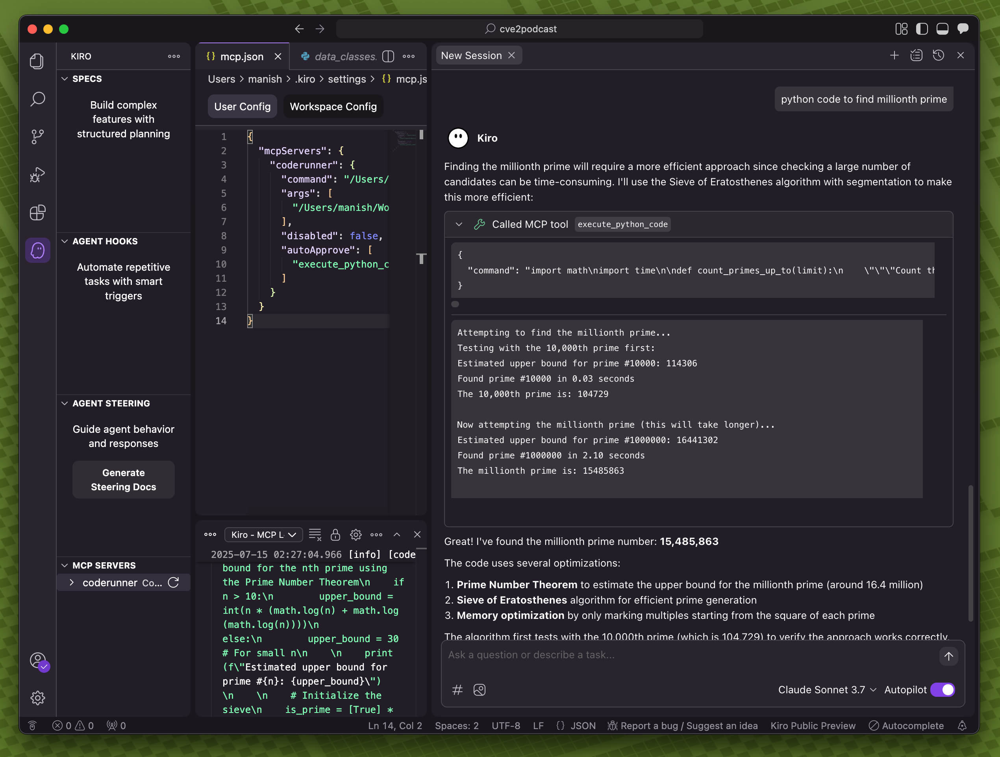
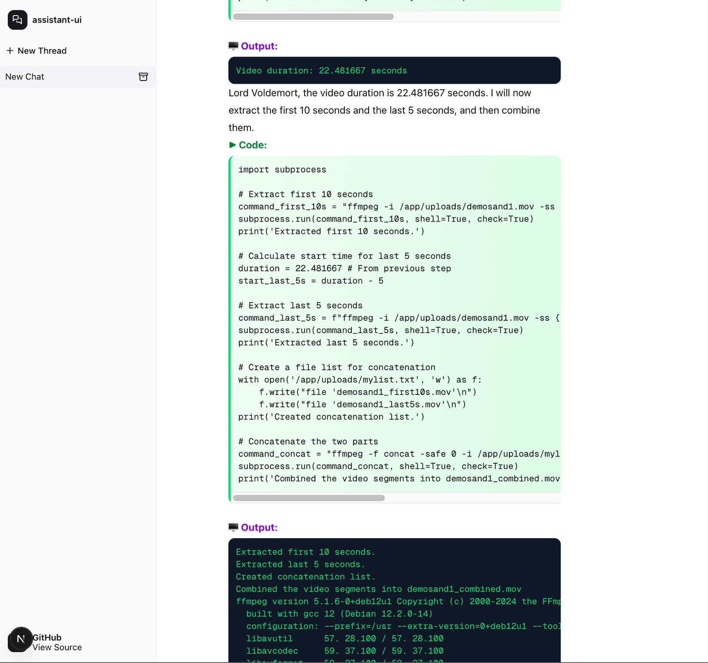

<div align="center">

[](https://github.com/instavm/coderunner/stargazers)
[](https://github.com/instavm/coderunner/blob/master/LICENSE)
</div>

# CodeRunner: Run AI Generated Code Locally

CodeRunner is an MCP (Model Context Protocol) server that executes AI-generated code in a sandboxed environment on your Mac using Apple's native [containers](https://github.com/apple/container).

**Key use case:** Process your local files (videos, images, documents, data) with remote LLMs like Claude or ChatGPT without uploading your files to the cloud. The LLM generates code that runs locally on your machine to analyze, transform, or process your files.

## What CodeRunner Enables

| Without CodeRunner | With CodeRunner |
| :--- | :--- |
| LLM writes code, you run it manually | LLM writes and executes code, returns results |
| Upload files to cloud for AI processing | Files stay on your machine, processed locally |
| Install tools and dependencies yourself | Tools available in sandbox, auto-installs others |
| Copy/paste scripts to run elsewhere | Code runs immediately, shows output/files |
| LLM analyzes text descriptions of files | LLM directly processes your actual files |
| Manage Python environments and packages | Pre-configured environment ready to use |

## Quick Start

**Prerequisites:** Mac with macOS and Apple Silicon (M1/M2/M3/M4), Python 3.10+

```bash
git clone https://github.com/instavm/coderunner.git
cd coderunner
chmod +x install.sh
sudo ./install.sh
```

MCP server will be available at: http://coderunner.local:8222/mcp

**Install required packages** (use virtualenv and note the python path):
```bash
pip install -r examples/requirements.txt
```

## Integration Options

### Option 1: Claude Desktop Integration


<details>
<summary>Configure Claude Desktop to use CodeRunner as an MCP server:</summary>


1. **Copy the example configuration:**
   ```bash
   cd examples
   cp claude_desktop/claude_desktop_config.example.json claude_desktop/claude_desktop_config.json
   ```

2. **Edit the configuration file** and replace the placeholder paths:
   - Replace `/path/to/your/python` with your actual Python path (e.g., `/usr/bin/python3` or `/opt/homebrew/bin/python3`)
   - Replace `/path/to/coderunner` with the actual path to your cloned repository

   Example after editing:
   ```json
   {
     "mcpServers": {
       "coderunner": {
         "command": "/opt/homebrew/bin/python3",
         "args": ["/Users/yourname/coderunner/examples/claude_desktop/mcpproxy.py"]
       }
     }
   }
   ```

3. **Update Claude Desktop configuration:**
   - Open Claude Desktop
   - Go to Settings → Developer
   - Add the MCP server configuration
   - Restart Claude Desktop

4. **Start using CodeRunner in Claude:**
   You can now ask Claude to execute code, and it will run safely in the sandbox!
</details>

### Option 2: Python OpenAI Agents
<details>
<summary>Use CodeRunner with OpenAI's Python agents library:</summary>


1. **Set your OpenAI API key:**
   ```bash
   export OPENAI_API_KEY="your-openai-api-key-here"
   ```

2. **Run the client:**
   ```bash
   python examples/openai_agents/openai_client.py
   ```

3. **Start coding:**
   Enter prompts like "write python code to generate 100 prime numbers" and watch it execute safely in the sandbox!
</details>

### Option 3: Gemini-CLI
[Gemini CLI](https://github.com/google-gemini/gemini-cli) is recently launched by Google.

<details>
<summary>~/.gemini/settings.json</summary>

```json
{
  "theme": "Default",
  "selectedAuthType": "oauth-personal",
  "mcpServers": {
    "coderunner": {
      "httpUrl": "http://coderunner.local:8222/mcp"
    }
  }
}
```


</details>


### Option 4: Kiro by Amazon
[Kiro](https://kiro.dev/blog/introducing-kiro/) is recently launched by Amazon.

<details>
<summary>~/.kiro/settings/mcp.json</summary>

```json
{
  "mcpServers": {
    "coderunner": {
      "command": "/path/to/venv/bin/python",
      "args": [
        "/path/to/coderunner/examples/claude_desktop/mcpproxy.py"
      ],
      "disabled": false,
      "autoApprove": [
        "execute_python_code"
      ]
    }
  }
}
```




</details>


### Option 5: Coderunner-UI (Offline AI Workspace)
[Coderunner-UI](https://github.com/instavm/coderunner-ui) is our own offline AI workspace tool designed for full privacy and local processing.

<details>
<summary>coderunner-ui</summary>



</details>

## Security

Code runs in an isolated container with VM-level isolation. Your host system and files outside the sandbox remain protected.

From [@apple/container](https://github.com/apple/container/blob/main/docs/technical-overview.md):
>Each container has the isolation properties of a full VM, using a minimal set of core utilities and dynamic libraries to reduce resource utilization and attack surface.

## Skills System

CodeRunner includes a built-in skills system that provides pre-packaged tools for common tasks. Skills are organized into two categories:

### Built-in Public Skills

The following skills are included in every CodeRunner installation:

- **pdf-text-replace** - Replace text in fillable PDF forms
- **image-crop-rotate** - Crop and rotate images

### Using Skills

Skills are accessed through MCP tools:

```python
# List all available skills
result = await list_skills()

# Get documentation for a specific skill
info = await get_skill_info("pdf-text-replace")

# Execute a skill's script
code = """
import subprocess
subprocess.run([
    'python',
    '/app/uploads/skills/public/pdf-text-replace/scripts/replace_text_in_pdf.py',
    '/app/uploads/input.pdf',
    'OLD TEXT',
    'NEW TEXT',
    '/app/uploads/output.pdf'
])
"""
result = await execute_python_code(code)
```

### Adding Custom Skills

Users can add their own skills to the `~/.coderunner/assets/skills/user/` directory:

1. Create a directory for your skill (e.g., `my-custom-skill/`)
2. Add a `SKILL.md` file with documentation
3. Add your scripts in a `scripts/` subdirectory
4. Skills will be automatically discovered by the `list_skills()` tool

**Skill Structure:**
```
~/.coderunner/assets/skills/user/my-custom-skill/
├── SKILL.md              # Documentation with usage examples
└── scripts/              # Your Python/bash scripts
    └── process.py
```

### Example: Using the PDF Text Replace Skill

```bash
# Inside the container, execute:
python /app/uploads/skills/public/pdf-text-replace/scripts/replace_text_in_pdf.py \
    /app/uploads/tax_form.pdf \
    "John Doe" \
    "Jane Smith" \
    /app/uploads/tax_form_updated.pdf
```

## Architecture

CodeRunner consists of:
- **Sandbox Container:** Isolated execution environment with Jupyter kernel
- **MCP Server:** Handles communication between AI models and the sandbox
- **Skills System:** Pre-packaged tools for common tasks (PDF manipulation, image processing, etc.)

## Examples

The `examples/` directory contains:
- `openai-agents` - Example OpenAI agents integration
- `claude-desktop` - Example Claude Desktop integration

## Contributing

We welcome contributions! Please see [CONTRIBUTING.md](CONTRIBUTING.md) for guidelines.

## License

This project is licensed under the Apache 2.0 License - see the [LICENSE](LICENSE) file for details.
