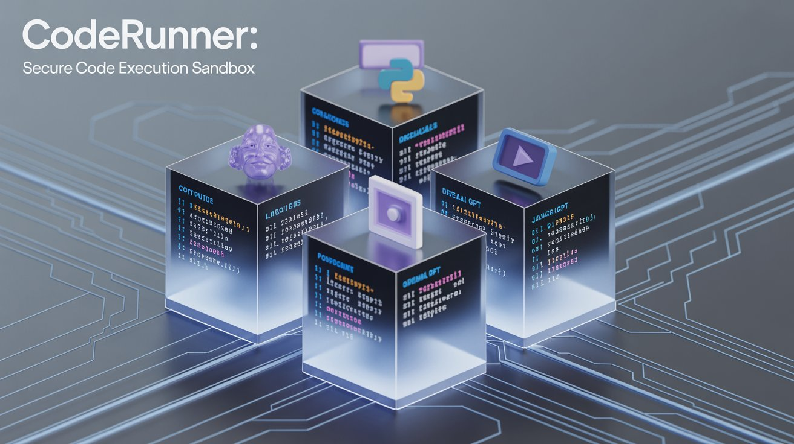

# ⚡ CodeRunner: Securely Run AI Generated Code Locally

CodeRunner provides a secure MCP (Model Context Protocol) code execution server that runs inside a sandboxed environment on your Mac, powered by Apple's native [containers](https://github.com/apple/container). It allows you to safely execute code generated by AI models like Claude, OpenAI GPT, or Ollama.

Leverage powerful remote LLMs (like ChatGPT or Claude Sonnet 4) to work with your local files—such as videos—securely on your Mac. The LLM runs in a sandboxed environment where it can install external libraries, generate code, and execute it `locally` without uploading your data to the cloud.


### **Claude Desktop / OpenAI / Local LLM: With vs. Without CodeRunner**

The examples below are just a sample of what's possible. CodeRunner can handle a wide range of tasks involving code execution, file manipulation, and data processing.

| Capability | Without CodeRunner (Instructions Only) | With CodeRunner (Interactive Execution) |
| :--- | :--- | :--- |
| **Core Function** | ❌ **Writes code & commands.** You must run everything yourself locally. | ✅ **Writes AND runs code.** Get results, files, and charts instantly in the chat. |
| **Local Data Processing** | ❌ **Uploads your data to cloud servers** You must upload your data to openai/claude cloud if you want AI to do any processing on them. | ✅ **Data never leaves your computer** Your data is not uploaded to their cloud. |
| **Using System Tools** <br/> *(e.g., ffmpeg, git, awk)* | ❌ **Provides the command.** Requires you to install and run tools manually. | ✅ **Runs tools for you.** Processes your uploaded files directly. No installation needed. |
| **Data Analysis & Charts** <br/> *(e.g., with Python, R)* | ❌ **Provides the script.** You must set up your environment to run it. | ✅ **Performs analysis & shows charts.** Processes data and displays visualizations directly. |
| **Working with Files** <br/> *(e.g., CSV, JSON, images)* | ❌ **Analyzes text content.** Cannot modify or generate new files for you. | ✅ **Processes & creates files.** Upload a file, have it transformed, and download the result. |
| **Software Dependencies** | ❌ **You manage everything.** Relies entirely on your local installations. | ✅ **Self-contained sandbox.** Comes with many tools; can install more on-the-fly. |


This guide shows you how to use the pre-built CodeRunner sandbox.

## 🚀 Quick Start

### Prerequisites

- Mac with preferably macOS and Apple Silicon (M1/M2/M3/M4 series)
- **Python 3.10+**

### Step 1: Clone the Repository

```bash
git clone https://github.com/BandarLabs/coderunner.git
cd coderunner
```

### Step 2: Make the Script Executable

   ```bash
   chmod +x install.sh
   ```

### Step 3: Run the Script

   ```bash
   sudo ./install.sh
   ```

**MCP server will be available at:**
> http://coderunner.local:8222/sse


### Step 4: Install required packages
> You should do this in a virtualenv and note the python path for later use.
```bash
pip install -r examples/requirements.txt
```

## 🔌 Integration Options

### Option 1: Claude Desktop Integration

Configure Claude Desktop to use CodeRunner as an MCP server:


1. **Copy the example configuration:**
   ```bash
   cd examples
   cp claude_desktop/claude_desktop_config.example.json claude_desktop/claude_desktop_config.json
   ```

2. **Edit the configuration file** and replace the placeholder paths:
   - Replace `/path/to/your/python` with your actual Python path (e.g., `/usr/bin/python3` or `/opt/homebrew/bin/python3`)
   - Replace `/path/to/coderunner` with the actual path to your cloned repository

   Example after editing:
   ```json
   {
     "mcpServers": {
       "coderunner": {
         "command": "/opt/homebrew/bin/python3",
         "args": ["/Users/yourname/coderunner/examples/claude_desktop/mcpproxy.py"]
       }
     }
   }
   ```

3. **Update Claude Desktop configuration:**
   - Open Claude Desktop
   - Go to Settings → Developer
   - Add the MCP server configuration
   - Restart Claude Desktop

4. **Start using CodeRunner in Claude:**
   You can now ask Claude to execute code, and it will run safely in the sandbox!

### Option 2: Python OpenAI Agents

Use CodeRunner with OpenAI's Python agents library:


1. **Set your OpenAI API key:**
   ```bash
   export OPENAI_API_KEY="your-openai-api-key-here"
   ```

2. **Run the client:**
   ```bash
   python examples/openai_agents/openai_client.py
   ```

4. **Start coding:**
   Enter prompts like "write python code to generate 100 prime numbers" and watch it execute safely in the sandbox!

## 🛡️ Security Features

### Sandboxed Execution
All code runs in an isolated container environment, ensuring your host system remains secure.

From [@apple/container](https://github.com/apple/container/blob/main/docs/technical-overview.md) documentation -
>Security: Each container has the isolation properties of a full VM, using a minimal set of core utilities and dynamic libraries to reduce resource utilization and attack surface.

## 🏗️ Architecture

CodeRunner consists of:
- **Sandbox Container:** Isolated execution environment with Jupyter kernel
- **MCP Server:** Handles communication between AI models and the sandbox
- **Proxy Layer:** Manages connections and security

## 📚 Examples

The `examples/` directory contains:
- `openai-agents` - Example OpenAI agents integration
- `claude-desktop` - Example Claude Desktop integration


## 🤝 Contributing

We welcome contributions! Please see [CONTRIBUTING.md](CONTRIBUTING.md) for guidelines.

## 📄 License

This project is licensed under the MIT License - see the [LICENSE](LICENSE) file for details.
