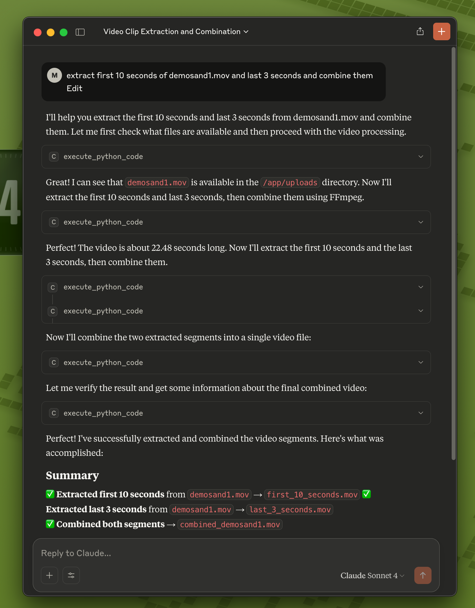
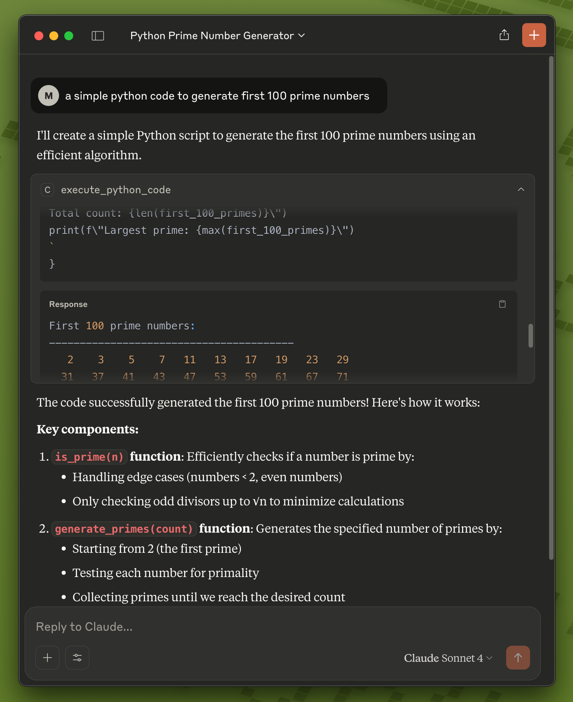
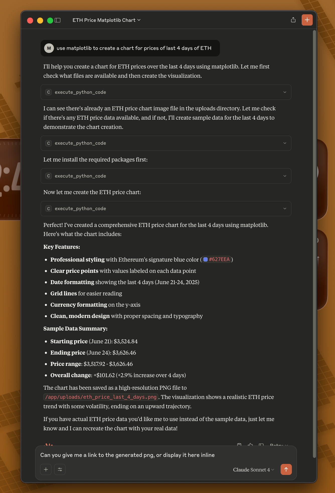
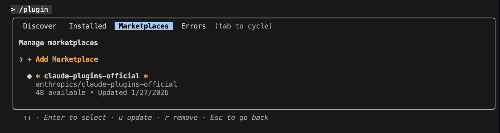
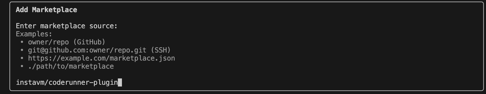
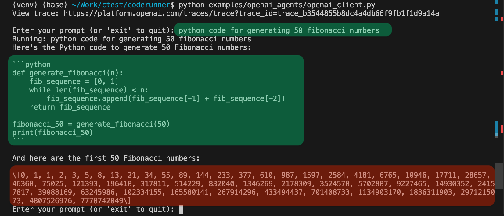
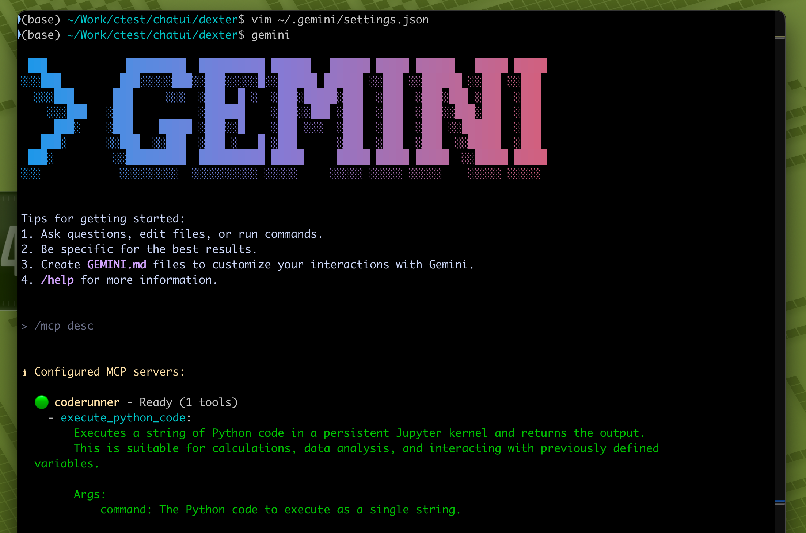
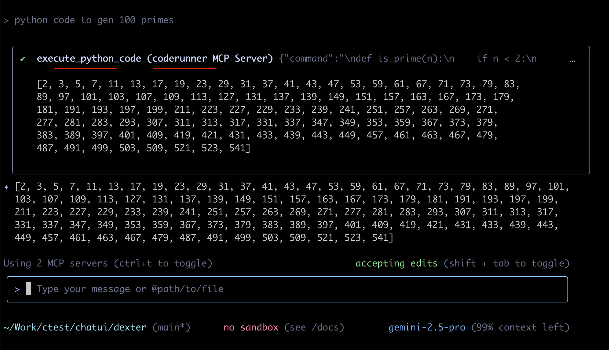
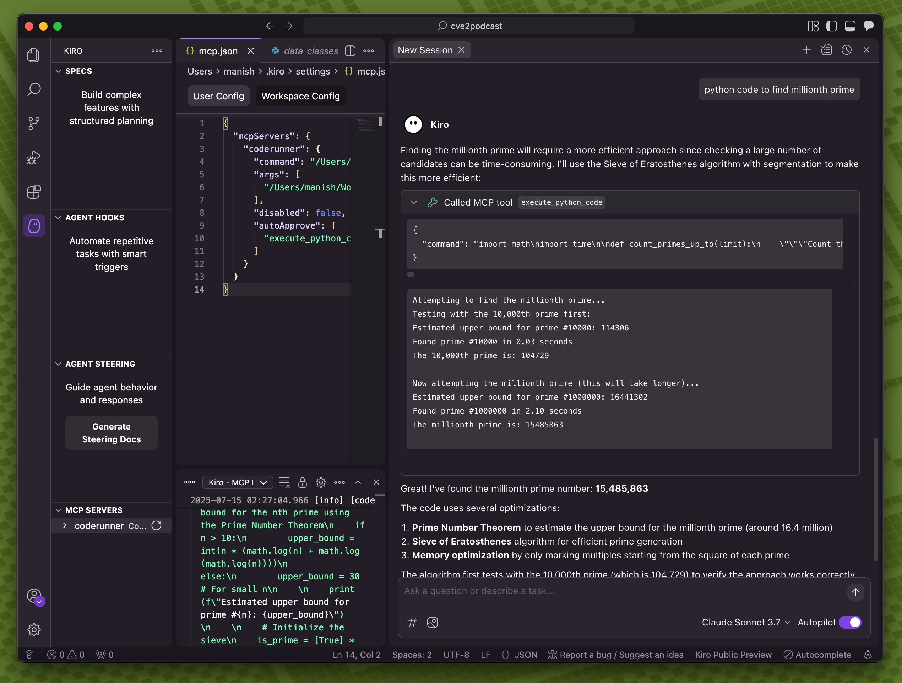
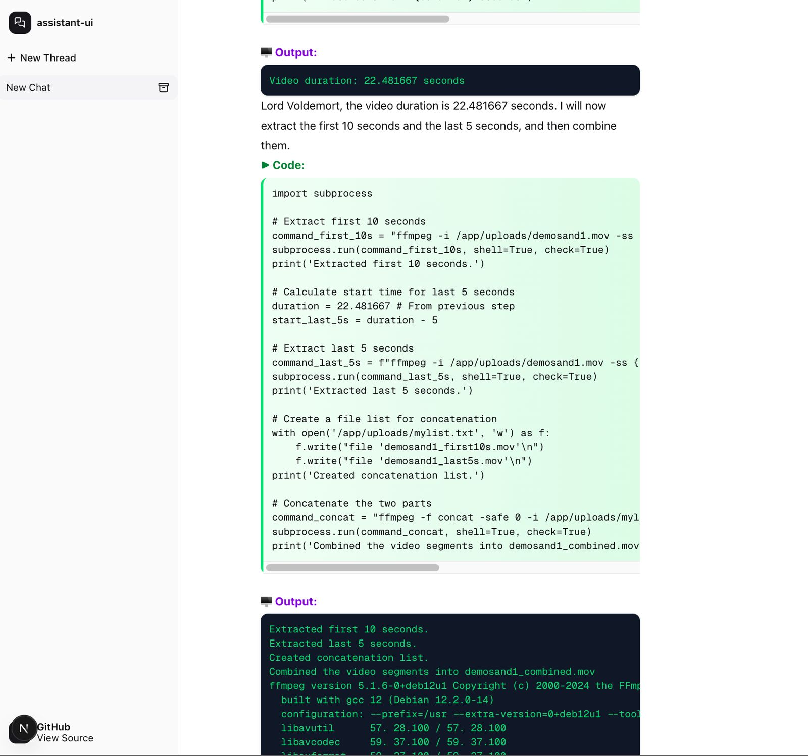

<div align="center">

[](https://github.com/instavm/coderunner/stargazers)
[](https://github.com/instavm/coderunner/blob/master/LICENSE)
</div>

# CodeRunner: A local sandbox for your AI agents

CodeRunner helps you sandbox your AI agents and its actions inside a sandbox. 

**Key use case:** You can run multiple Claude Code or AI agents in our sandbox without any fear of data loss and exfilteration.


## Quick Start

**Prerequisites:** Mac with macOS and Apple Silicon (M1/M2/M3/M4), Python 3.10+

```bash
git clone https://github.com/instavm/coderunner.git
cd coderunner
chmod +x install.sh
./install.sh
```


## Run Claude Code inside a Sandbox

`./install.sh` (if not already done)

`container exec -it coderunner /bin/bash`

`root@coderunner:/app# npm install -g @anthropic-ai/claude-code`


## Other Integration Options

MCP server will be available at: `http://coderunner.local:8222/mcp`

**Install required packages** (use virtualenv and note the python path):
```bash
pip install -r examples/requirements.txt
```

#### 1. Claude Desktop Integration


<details>
<summary>Configure Claude Desktop to use CodeRunner as an MCP server:</summary>







1. **Copy the example configuration:**
   ```bash
   cd examples
   cp claude_desktop/claude_desktop_config.example.json claude_desktop/claude_desktop_config.json
   ```

2. **Edit the configuration file** and replace the placeholder paths:
   - Replace `/path/to/your/python` with your actual Python path (e.g., `/usr/bin/python3` or `/opt/homebrew/bin/python3`)
   - Replace `/path/to/coderunner` with the actual path to your cloned repository

   Example after editing:
   ```json
   {
     "mcpServers": {
       "coderunner": {
         "command": "/opt/homebrew/bin/python3",
         "args": ["/Users/yourname/coderunner/examples/claude_desktop/mcpproxy.py"]
       }
     }
   }
   ```

3. **Update Claude Desktop configuration:**
   - Open Claude Desktop
   - Go to Settings → Developer
   - Add the MCP server configuration
   - Restart Claude Desktop

4. **Start using CodeRunner in Claude:**
   You can now ask Claude to execute code, and it will run safely in the sandbox!
</details>

#### 2. Claude Code CLI

<details>
<summary>Use CodeRunner with Claude Code CLI for terminal-based AI assistance:</summary>

**Quick Start:**

```bash
# 1. Install and start CodeRunner (one-time setup)
git clone https://github.com/instavm/coderunner.git
cd coderunner
sudo ./install.sh

# 2. Install the Claude Code plugin
claude plugin marketplace add https://github.com/instavm/coderunner-plugin
claude plugin install instavm-coderunner

# 3. Reconnect to MCP servers
/mcp
```

**Installation Steps:**

1. Navigate to Plugin Marketplace:

   

2. Add the InstaVM repository:

   

3. Execute Python code with Claude Code:

   

That's it! Claude Code now has access to all CodeRunner tools:
- **execute_python_code** - Run Python code in persistent Jupyter kernel
- **navigate_and_get_all_visible_text** - Web scraping with Playwright
- **list_skills** - List available skills (docx, xlsx, pptx, pdf, image processing, etc.)
- **get_skill_info** - Get documentation for specific skills
- **get_skill_file** - Read skill files and examples

**Learn more:** See the [plugin repository](https://github.com/instavm/coderunner-plugin) for detailed documentation.

</details>

#### 3. OpenCode Configuration

<details>
<summary>Configure OpenCode to use CodeRunner as an MCP server:</summary>


Create or edit `~/.config/opencode/opencode.json`:

```json
{
  "$schema": "https://opencode.ai/config.json",
  "mcp": {
    "coderunner": {
      "type": "remote",
      "url": "http://coderunner.local:8222/mcp",
      "enabled": true
    }
  }
}
```

After saving the configuration:
1. Restart OpenCode
2. CodeRunner tools will be available automatically
3. Start executing Python code with full access to the sandboxed environment

</details>

#### 4. Python OpenAI Agents
<details>
<summary>Use CodeRunner with OpenAI's Python agents library:</summary>



1. **Set your OpenAI API key:**
   ```bash
   export OPENAI_API_KEY="your-openai-api-key-here"
   ```

2. **Run the client:**
   ```bash
   python examples/openai_agents/openai_client.py
   ```

3. **Start coding:**
   Enter prompts like "write python code to generate 100 prime numbers" and watch it execute safely in the sandbox!
</details>

#### 5. Gemini-CLI
[Gemini CLI](https://github.com/google-gemini/gemini-cli) is recently launched by Google.

<details>
<summary>~/.gemini/settings.json</summary>

```json
{
  "theme": "Default",
  "selectedAuthType": "oauth-personal",
  "mcpServers": {
    "coderunner": {
      "httpUrl": "http://coderunner.local:8222/mcp"
    }
  }
}
```





</details>


#### 6. Kiro by Amazon
[Kiro](https://kiro.dev/blog/introducing-kiro/) is recently launched by Amazon.

<details>
<summary>~/.kiro/settings/mcp.json</summary>

```json
{
  "mcpServers": {
    "coderunner": {
      "command": "/path/to/venv/bin/python",
      "args": [
        "/path/to/coderunner/examples/claude_desktop/mcpproxy.py"
      ],
      "disabled": false,
      "autoApprove": [
        "execute_python_code"
      ]
    }
  }
}
```




</details>


#### 7. Coderunner-UI (Offline AI Workspace)
[Coderunner-UI](https://github.com/instavm/coderunner-ui) is our own offline AI workspace tool designed for full privacy and local processing.

<details>
<summary>coderunner-ui</summary>



</details>

## Security

Code runs in an isolated container with VM-level isolation. Your host system and files outside the sandbox remain protected.

From [@apple/container](https://github.com/apple/container/blob/main/docs/technical-overview.md):
>Each container has the isolation properties of a full VM, using a minimal set of core utilities and dynamic libraries to reduce resource utilization and attack surface.

## Skills System

CodeRunner includes a built-in skills system that provides pre-packaged tools for common tasks. Skills are organized into two categories:

### Built-in Public Skills

The following skills are included in every CodeRunner installation:

- **pdf-text-replace** - Replace text in fillable PDF forms
- **image-crop-rotate** - Crop and rotate images

### Using Skills

Skills are accessed through MCP tools:

```python
# List all available skills
result = await list_skills()

# Get documentation for a specific skill
info = await get_skill_info("pdf-text-replace")

# Execute a skill's script
code = """
import subprocess
subprocess.run([
    'python',
    '/app/uploads/skills/public/pdf-text-replace/scripts/replace_text_in_pdf.py',
    '/app/uploads/input.pdf',
    'OLD TEXT',
    'NEW TEXT',
    '/app/uploads/output.pdf'
])
"""
result = await execute_python_code(code)
```

### Adding Custom Skills

Users can add their own skills to the `~/.coderunner/assets/skills/user/` directory:

1. Create a directory for your skill (e.g., `my-custom-skill/`)
2. Add a `SKILL.md` file with documentation
3. Add your scripts in a `scripts/` subdirectory
4. Skills will be automatically discovered by the `list_skills()` tool

**Skill Structure:**
```
~/.coderunner/assets/skills/user/my-custom-skill/
├── SKILL.md              # Documentation with usage examples
└── scripts/              # Your Python/bash scripts
    └── process.py
```

### Example: Using the PDF Text Replace Skill

```bash
# Inside the container, execute:
python /app/uploads/skills/public/pdf-text-replace/scripts/replace_text_in_pdf.py \
    /app/uploads/tax_form.pdf \
    "John Doe" \
    "Jane Smith" \
    /app/uploads/tax_form_updated.pdf
```

## Architecture

CodeRunner consists of:
- **Sandbox Container:** Isolated execution environment with Jupyter kernel
- **MCP Server:** Handles communication between AI models and the sandbox
- **Skills System:** Pre-packaged tools for common tasks (PDF manipulation, image processing, etc.)

## Examples

The `examples/` directory contains:
- `openai-agents` - Example OpenAI agents integration
- `claude-desktop` - Example Claude Desktop integration

## Building Container Image Tutorial

https://github.com/apple/container/blob/main/docs/tutorial.md

## Roadmap
1. Linux support with Firecracker
2. Guardrails for external agentic actions
3. CLI for Coderunner
## Contributing

We welcome contributions! Please see [CONTRIBUTING.md](CONTRIBUTING.md) for guidelines.

## License

This project is licensed under the Apache 2.0 License - see the [LICENSE](LICENSE) file for details.
